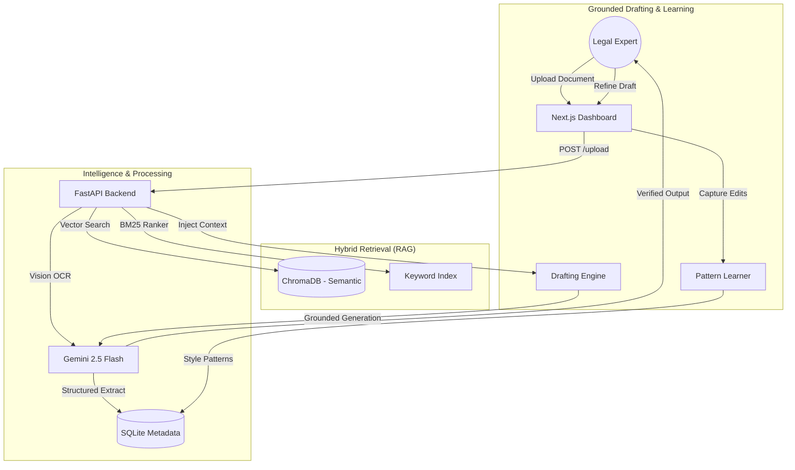

# CaseCraft: Next-Generation Legal Intelligence & Drafting

**CaseCraft** is a premium, AI-first platform designed to streamline the legal drafting lifecycle. It transforms fragmented, scanned, and handwritten legal documents into structured, grounded, and professionally formatted drafts with a built-in active learning loop.

---

## 🏗️ System Architecture

---

## ✨ Key Features

-   **Intelligent Document Ingestion**: Leverages multi-modal LLMs (Gemini Flash) to perform high-accuracy OCR on degraded scans, rotated pages, and handwritten legal notes.
-   **Verifiable Grounding (RAG)**: Anchors every claim in your draft to source evidence. A simple click on a citation highlights the exact passage in the original document for instant verification.
-   **Hybrid Retrieval Engine**: Combines semantic vector search (ChromaDB) with keyword-exact matching (BM25) to ensure critical legal terms and case numbers are never missed.
-   **Active Learning Loop**: Learns your specific writing style and legal preferences. As you edit drafts, the system extracts patterns (e.g., phrasing, tone, structure) to make future generations more accurate.
-   **Commander Dashboard**: A premium, high-contrast 3-panel workspace designed for maximum efficiency during document review and drafting.

---

## 🛠️ Technical Implementation

### **Core Stack**
-   **AI Infrastructure**: Powered by Google Gemini 2.5 Flash for multimodal reasoning and long-context analysis.
-   **Backend**: Python-based FastAPI service featuring a custom-built hybrid retrieval pipeline.
-   **Database**: SQLite for metadata persistence and ChromaDB for high-performance vector retrieval.
-   **Frontend**: A modern Next.js 14 application with a high-contrast design system and real-time state management.

### **The Active Learning Pipeline**
Unlike static RAG systems, CaseCraft includes a dedicated **Pattern Learner** that performs differential analysis between AI-generated drafts and human-perfected versions. This creates a continuously improving feedback loop, tailoring the AI's "voice" to match the user's professional style.

---

## 🚀 Quick Start

### **Backend Setup**
1. Navigate to `backend/`
2. Create and activate a virtual environment: `python -m venv venv && source venv/bin/activate`
3. Install dependencies: `pip install -r requirements.txt`
4. Configure `.env` with your API keys.
5. Launch the server: `uvicorn main:app --reload --port 8000`

### **Frontend Setup**
1. Navigate to `frontend/`
2. Install dependencies: `npm install`
3. Run the development server: `npm run dev`
4. Visit `http://localhost:3000` to start drafting.

> [!IMPORTANT]
> **Note on API Usage**: The included API configurations are intended for **testing and demonstration purposes only**. Ensure you rotate keys or use environment-specific variables for any production-level deployment.

---

## ⚖️ Design Philosophy
CaseCraft was built on the principle of **"Verification over Generation."** In the legal field, accuracy is non-negotiable. Our system prioritizes transparency by making every AI-generated sentence inspectable, ensuring that the technology assists the expert without sacrificing professional integrity.

---

## 👥 Author
**Ashraful Kabir**  
*AI Engineer & Full-Stack Developer*  
[GitHub Profile](https://github.com/AshrafulKabir7)
